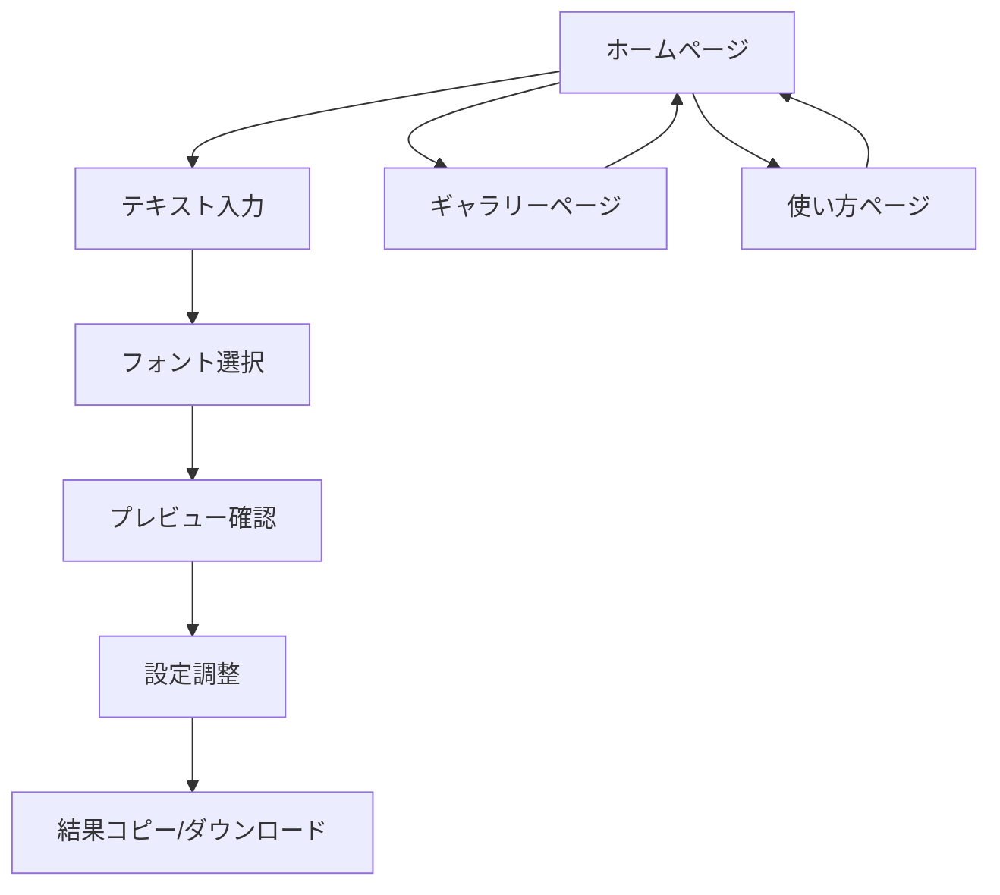

# アスキーアートWebサービス 要件定義書

## 1. Product Overview
ユーザーが入力したテキストを様々なスタイルのアスキーアートに変換するWebサービスです。
シンプルで直感的なインターフェースを通じて、誰でも簡単に美しいアスキーアートを作成できます。
SNSやメッセージアプリでの利用、プログラミングコメント装飾など、幅広い用途での活用を目指します。

## 2. Core Features

### 2.1 User Roles
本サービスはユーザー登録不要で利用可能なため、特別な役割区分は設けません。

### 2.2 Feature Module
本アスキーアートサービスは以下の主要ページで構成されます：
1. **ホームページ**: テキスト入力フォーム、フォント選択、プレビュー表示、結果コピー機能
2. **ギャラリーページ**: サンプルアスキーアート集、人気フォント紹介
3. **使い方ページ**: 基本的な使用方法、フォント説明、活用例

### 2.3 Page Details

| Page Name | Module Name | Feature description |
|-----------|-------------|---------------------|
| ホームページ | テキスト入力フォーム | テキスト入力、リアルタイムプレビュー、文字数制限表示 |
| ホームページ | フォント選択パネル | 複数のアスキーフォント選択、プレビュー表示 |
| ホームページ | 結果表示エリア | 生成されたアスキーアート表示、コピーボタン、ダウンロード機能 |
| ホームページ | 設定オプション | 文字幅調整、背景色変更、出力形式選択 |
| ギャラリーページ | サンプル集 | 事前作成されたアスキーアート例、カテゴリ分類 |
| ギャラリーページ | フォント紹介 | 各フォントの特徴説明、使用例表示 |
| 使い方ページ | 基本操作ガイド | ステップバイステップの使用方法説明 |
| 使い方ページ | 活用例紹介 | SNS投稿例、プログラミングでの活用方法 |

## 3. Core Process
ユーザーの基本的な操作フローは以下の通りです：

1. ホームページにアクセス
2. テキスト入力フォームに変換したい文字を入力
3. フォント選択パネルから好みのスタイルを選択
4. リアルタイムでプレビューを確認
5. 設定オプションで細かい調整（オプション）
6. 結果をコピーまたはダウンロード

## 4. User Interface Design
### 4.1 Design Style
- **プライマリカラー**: #2563eb（青）、セカンダリカラー: #64748b（グレー）
- **ボタンスタイル**: 角丸（8px）、ホバー効果付き
- **フォント**: メイン - Inter、コード表示 - JetBrains Mono
- **レイアウト**: シングルページアプリケーション、カード型コンポーネント
- **アイコン**: Heroicons、シンプルでモダンなスタイル

### 4.2 Page Design Overview

| Page Name | Module Name | UI Elements |
|-----------|-------------|-------------|
| ホームページ | テキスト入力フォーム | 大きなテキストエリア、文字数カウンター、クリアボタン |
| ホームページ | フォント選択パネル | グリッドレイアウト、プレビュー付きカード、選択状態表示 |
| ホームページ | 結果表示エリア | 等幅フォント、スクロール可能、コピーボタン、ダウンロードボタン |
| ホームページ | 設定オプション | スライダー、カラーピッカー、ドロップダウン |
| ギャラリーページ | サンプル集 | マソンリーレイアウト、カテゴリタブ、検索機能 |
| 使い方ページ | ガイドセクション | ステップ番号、スクリーンショット、コードブロック |

### 4.3 Responsiveness
モバイルファーストのレスポンシブデザインを採用し、タッチ操作に最適化されたインターフェースを提供します。