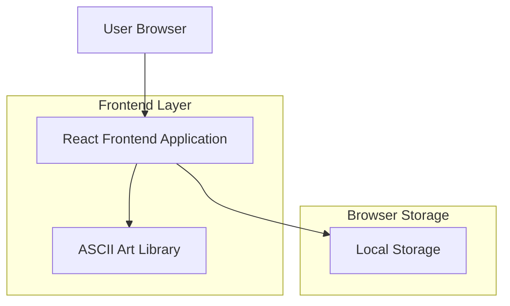
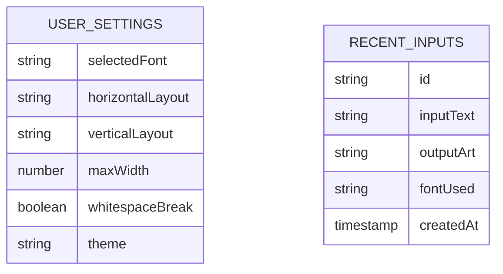

# アスキーアートWebサービス 技術アーキテクチャ文書

## 1. Architecture design



## 2. Technology Description

- Frontend: React@18 + TypeScript@5 + Vite@5 + Tailwind CSS@3
- ASCII Art Library: figlet.js (JavaScript port of FIGlet)
- State Management: React useState/useContext
- Build Tool: Vite
- Deployment: Static hosting (Vercel/Netlify)

## 3. Route definitions

| Route | Purpose |
|-------|----------|
| / | ホームページ、メインのアスキーアート変換機能 |
| /gallery | ギャラリーページ、サンプルアスキーアート集 |
| /guide | 使い方ページ、基本操作ガイドと活用例 |

## 4. API definitions

本サービスはクライアントサイドのみで動作するため、外部APIは使用しません。
アスキーアート変換はfiglet.jsライブラリを使用してブラウザ内で処理されます。

### 4.1 Core Functions

**アスキーアート変換機能**
```typescript
interface AsciiArtOptions {
  font: string;
  horizontalLayout?: 'default' | 'full' | 'fitted';
  verticalLayout?: 'default' | 'full' | 'fitted';
  width?: number;
  whitespaceBreak?: boolean;
}

interface AsciiArtResult {
  text: string;
  success: boolean;
  error?: string;
}

function generateAsciiArt(input: string, options: AsciiArtOptions): Promise<AsciiArtResult>
```

**フォント管理機能**
```typescript
interface FontInfo {
  name: string;
  displayName: string;
  category: 'standard' | 'decorative' | 'block' | 'script';
  preview: string;
}

function getAvailableFonts(): FontInfo[]
function loadFont(fontName: string): Promise<boolean>
```

## 5. Data model

### 5.1 Data model definition

本サービスはデータベースを使用せず、ブラウザのLocal Storageを使用してユーザー設定を保存します。



### 5.2 Local Storage Schema

**ユーザー設定 (localStorage key: 'ascii-art-settings')**
```typescript
interface UserSettings {
  selectedFont: string; // デフォルト: 'Standard'
  horizontalLayout: 'default' | 'full' | 'fitted'; // デフォルト: 'default'
  verticalLayout: 'default' | 'full' | 'fitted'; // デフォルト: 'default'
  maxWidth: number; // デフォルト: 80
  whitespaceBreak: boolean; // デフォルト: true
  theme: 'light' | 'dark'; // デフォルト: 'light'
}
```

**最近の入力履歴 (localStorage key: 'ascii-art-history')**
```typescript
interface RecentInput {
  id: string;
  inputText: string;
  outputArt: string;
  fontUsed: string;
  createdAt: number; // timestamp
}

type RecentInputs = RecentInput[]; // 最大10件まで保存
```

**利用可能フォント一覧**
```typescript
const AVAILABLE_FONTS = [
  { name: 'Standard', category: 'standard', displayName: 'スタンダード' },
  { name: 'Big', category: 'block', displayName: 'ビッグ' },
  { name: 'Block', category: 'block', displayName: 'ブロック' },
  { name: 'Bubble', category: 'decorative', displayName: 'バブル' },
  { name: 'Digital', category: 'decorative', displayName: 'デジタル' },
  { name: 'Graffiti', category: 'script', displayName: 'グラフィティ' },
  { name: 'Ghost', category: 'decorative', displayName: 'ゴースト' },
  { name: 'Speed', category: 'script', displayName: 'スピード' }
];
```